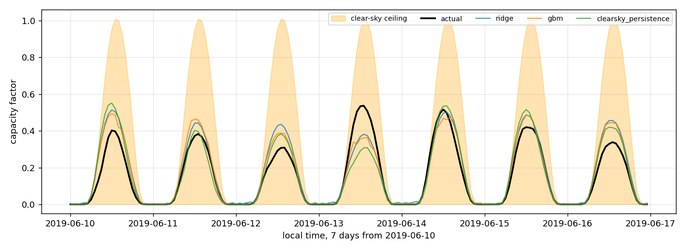

# What is weather information worth to a power forecast?

Day-ahead forecasts of German electricity **demand** and **solar generation**,
built to measure the same thing in both: how much a better weather input
actually buys once the model already has history.

The two targets answer it differently, and the contrast is the point.

- **Demand carries its own weather.** Yesterday's load already encodes
  yesterday's temperature, and temperature is 95% autocorrelated at 24 hours, so
  perfect foreknowledge of it — an upper bound no forecast can reach — is worth
  3.1% on average, and 15% in July and August.
- **Solar carries its own sky.** Where the sun will be is exact, free, and
  computable years ahead; but over 24 hours the clear-sky irradiance at a given
  hour moves **0.56%**, so yesterday's generation has already said it. What is
  left is cloud, and cloud is the only part a weather model is needed for.

Both models are scored against published baselines, verified with a
rolling-origin backtest, and checked by 26 assertions that run on synthetic data
with no network.

Data: [OPSD](https://open-power-system-data.org/) time series (2020-10-06
release) for German hourly load and solar generation 2015–2020, plus ERA5 2m
temperature on a 0.25° grid via the Copernicus CDS. Every number below
regenerates from this code. Full workings in **[ANALYSIS.md](ANALYSIS.md)**.

---

## Demand

Test period 2019-01-01 to 2020-09-30. Trained on 2015–2017, validated on 2018.
The models never see the test period.

| model | MAE (MW) | RMSE (MW) | MAPE | bias (MW) | skill vs naive |
|---|---:|---:|---:|---:|---:|
| **gradient boosting** | **1,201** | 1,623 | 2.27% | +258 | **0.503** |
| MLP (PyTorch) | 1,213 | 1,654 | 2.28% | +349 | 0.498 |
| ENTSO-E published forecast | 1,762 | 2,253 | 3.22% | **−608** | 0.271 |
| ridge | 1,837 | 2,526 | 3.48% | +287 | 0.240 |
| seasonal naive (168h) | 2,416 | 4,184 | 4.55% | −55 | 0 |
| mean of last 4 weeks | 2,648 | 4,134 | 4.94% | +75 | −0.096 |
| yesterday | 4,340 | 6,620 | 8.09% | −16 | −0.796 |

Gradient boosting removes just over half the seasonal-naive baseline's error.

The ENTSO-E row is the TSOs' own published day-ahead forecast, scored on the
same rows. Note its bias: it runs 608 MW low on average, which MAE hides
entirely. It is not a like-for-like comparison — that forecast is issued around
10:00 on D-1 rather than at midnight — but it is the right thing to measure
against.


The demand–temperature curve is a lopsided V: steep below 0 °C, far shallower
above the 15 °C minimum, and almost no data past 25 °C to fit a cooling response
to. The colouring is local hour, and the vertical spread it produces is the
point — hour of day moves demand by over 20 GW, temperature by perhaps 10 GW
across its whole range. That is the ratio a temperature feature fights.

---

## Solar

Same split, same protocol, same three models. The target is **capacity factor**,
not MW: installed capacity went from 37.2 GW to 50.5 GW over these six years, so
a model fitted on 2015 megawatts would under-predict 2020 by a third for reasons
that have nothing to do with weather.

Scored on **daylight hours only** — 8,196 of 15,336.

| model | MAE (cf) | RMSE (cf) | nRMSE | bias (cf) | skill vs naive |
|---|---:|---:|---:|---:|---:|
| **MLP (PyTorch)** | **0.0419** | 0.0623 | **6.23%** | +0.0052 | **0.056** |
| ridge | 0.0423 | 0.0618 | 6.18% | +0.0034 | 0.047 |
| yesterday | 0.0444 | 0.0696 | 6.96% | −0.0003 | 0 |
| clear-sky persistence | 0.0444 | 0.0697 | 6.97% | −0.0001 | −0.001 |
| gradient boosting | 0.0448 | 0.0656 | 6.56% | +0.0024 | −0.009 |
| last week | 0.0686 | 0.1016 | 10.16% | −0.0012 | −0.544 |

Models are fitted and tuned on daylight hours, not merely scored on them. That
matters: with night left in the validation set the metric that picks the ridge
alpha and the MLP's epoch count is half trivial rows, and ridge came out ahead.
Tuned on daylight the MLP wins and the booster falls below plain persistence.

Two things here matter more than the ranking.

**Night is dropped, and dropping it costs 46%.** Solar output is exactly zero for
43% of hours, and the mask removes 48% — every model predicts those perfectly.
Scored over all hours the best model reports 0.0227 instead of 0.0419, a
flattering of a number nobody forecast. Half of any all-hours solar skill score
is the planet rotating.

**Clear-sky persistence ties plain persistence**, and the tie is informative.
Carrying yesterday's cloudiness onto today's sky is the benchmark the solar
literature uses, and it ought to beat naive persistence. It does not, because
over 24 hours the clear-sky irradiance at a given hour moves 0.56%. It earns its
keep at longer horizons, not this one.

Gradient boosting finishing below persistence is worth stating plainly rather
than hiding in the table. Once night is gone the remaining signal is close to
linear in the clear-sky features, which is a shape a shallow booster fits worse
than a linear model or a small network.



The shaded ceiling is astronomy: solar position, air mass, and an isotropic-sky
transposition onto a 30° south-facing panel, expressed as a fraction of standard
test conditions. It costs nothing to know — no data, no forecast, computable
years ahead.

It is a loose upper bound rather than a tight one. The fleet reaches about half
of it even on the clearest June day, because the installed base is a mixture of
orientations and loses further to inverters, soiling and heat. What moves
day to day underneath it is cloud, and that is the part a forecast is for.

---

## Where the two targets meet

Both results are the same phenomenon from opposite sides. **At a 24-hour horizon,
yesterday's observation already carries the deterministic structure.**

For demand it carries yesterday's weather, which is 95% of today's. For solar it
carries yesterday's sun, which is 99.4% of today's. In both cases the explicit
physical feature is largely re-delivering what the lag already holds — and in
both cases what remains, a heatwave or a cloud field, is exactly the part that
needs a real forecast and the part where a better weather model would pay.

**Take the history away and the picture changes.** Rerunning the solar ablation
with every generation-derived feature dropped — the position of an asset with no
production record — weather goes from being worth 4.5% to **15.0%**:

| mode | with history | no history |
|---|---:|---:|
| `none` | 0.0446 | 0.0547 |
| `clearsky` | +0.4% | −1.3% |
| `lagged` | −0.9% | −2.4% |
| `perfect` | **−4.5%** | **−15.0%** |

So "weather barely helps" is a statement about a well-instrumented asset with
years of its own output, not about weather. The moment you have to say something
about a site that has not run yet, the exogenous channels are most of what you
have. That is the asset-yield problem, and this is the direction the repo would
extend into.

The `lagged` row is the one to read carefully. An earlier version of this table
reported it at −11.4%, because `kt_yesterday` — yesterday's clear-sky index — is
computed from yesterday's output and was not being dropped with the other
history. It is generation wearing a weather name. Removing it properly takes that
row down to −2.4%, and the honest reading is that almost all of the no-history
gain is temperature, not cloud persistence.

This is also the question asked of GraphCast, Pangu-Weather and AIFS once the
headline RMSE is in: the model verifies better against analysis, but does the
downstream decision improve? The mode structure here is a way of putting a number
on it. Swapping the synthetic error for archived operational forecasts — IFS and
an AI model, same issue and valid times — rescores under each without changing
any of the machinery.

---

## The weather grid

ERA5 arrives as a 33 × 41 grid at 0.25°, hourly. Averaging the whole rectangle
throws the geography away: 45% of that box is the North Sea, the Baltic, or one
of four neighbouring countries, and it weights open water the same as Berlin.

`src/geo.py` keeps the grid. Three reductions, selected with `--weighting`:

| | cells kept | implied area | demand MAE (MW) |
|---|---:|---:|---:|
| `box` — the whole rectangle | 1,353 | — | 1,179.6 |
| `land` — masked to the German outline | 740 | 357,451 km² | 1,175.7 |
| `population` — land, weighted by where people are | 740 | 357,451 km² | **1,163.1** |

The mask is a simplified border polygon, and the area it keeps is checkable
against a number from outside the repo: Germany is 357,000 km². The masked cells
come to 357,451 — 0.13% out.

The gain is real but small, 16.5 MW or 1.4%, and it is only visible under
`perfect`. Under `noisy` the error draw is larger than the effect, which is the
same 18 MW seed spread measured in [ANALYSIS.md](ANALYSIS.md).

Keeping the grid also buys `series_at(lat, lon)` — bilinear interpolation to an
arbitrary point — which is what the solar model runs on. Clear-sky irradiance
depends on latitude, so the national figure is built from the four TSO control
zone centroids weighted by generation, not from a single point.

---

## Running it

```bash
pip install -r requirements.txt

python run_comparison.py                                     # demand, no weather
python run_comparison.py --weather noisy                     # demand, with weather
python run_comparison.py --weather perfect --weighting box   # the grid ablation
python run_comparison.py --backtest                          # rolling-origin folds
python run_comparison.py --target solar                      # solar capacity factor
python ablations.py                                          # the ANALYSIS tables
python selfcheck.py                                          # 26 correctness checks
```

Everything runs from a clone. The derived inputs are committed, so neither the
125 MB OPSD download nor a Copernicus account is needed.

```
src/geo.py        the ERA5 grid, land mask, weighting, point interpolation
src/solar.py      solar position, clear sky, plane-of-array, cell temperature
src/data.py       OPSD demand and solar, ERA5 loading
src/features.py   features and the split, for both targets
src/models.py     ridge, gradient boosting, MLP
src/evaluate.py   baselines, metrics, daylight masking, backtest
results/          scores, predictions, figures/
ANALYSIS.md       mode ablations, seed study, folds, monthly breakdown
selfcheck.py      26 checks, synthetic data, no network
old-models/       the original single-file version, kept for reference
```

---

## Known limits

No forecast-origin structure, so no true lead-time verification. The ENTSO-E
comparison is not like-for-like. ERA5 is reanalysis, so nothing here measures an
operational forecast's skill — it measures what perfect information would be
worth. There is no perfect-irradiance mode for solar: bounding the cloud channel
needs archived forecast or observed irradiance, which is the same thing wind
would need and the reason wind is not here yet.
[Full list, with the measurement behind each](ANALYSIS.md#limitations).
