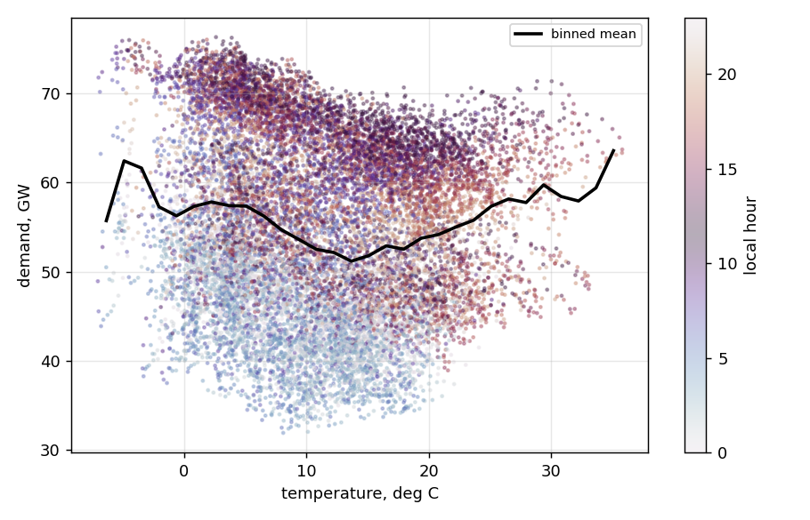

# Day-ahead load forecasting for Germany, and what weather data is worth to it

A day-ahead forecast of German hourly electricity demand, used to measure what
better weather information is actually worth.

Temperature enters through four switchable modes - `none`, `lagged`, `noisy`,
`perfect` - so the question gets a number rather than an assumption. `perfect`
is the ceiling: the most any weather model could contribute.

The answer is seasonal. Temperature is worth 13-16% in July and August and close
to nothing across winter. Establishing that took a ten-seed study and a
rolling-origin backtest, because on a single window the effect and the noise are
the same size.

Data: [OPSD](https://open-power-system-data.org/) time series (2020-10-06
release), German hourly load 2015-2020, plus ERA5 2m temperature (NetCDF, via
the Copernicus CDS). Every number below regenerates from this code in the pinned
environment. Full workings in **[ANALYSIS.md](ANALYSIS.md)**.



The demand-temperature curve is a lopsided V: steep below 0 degC, far shallower
above the 15 degC minimum, and almost no data past 25 degC to fit a cooling
response to. The colouring is local hour, and the vertical spread it produces is
the point - hour of day moves demand by over 20 GW, temperature by perhaps
10 GW across its whole range. That is the ratio a temperature feature fights.

---

## Results

Test period 2019-01-01 to 2020-09-30. Trained on 2015-2017, validated on 2018.
The models never see the test period.

| model | MAE (MW) | RMSE (MW) | MAPE | bias (MW) | skill vs naive |
|---|---:|---:|---:|---:|---:|
| **gradient boosting** | **1,201** | 1,623 | 2.27% | +258 | **0.503** |
| MLP (PyTorch) | 1,213 | 1,654 | 2.28% | +349 | 0.498 |
| ENTSO-E published forecast | 1,762 | 2,253 | 3.22% | **-608** | 0.271 |
| ridge | 1,837 | 2,526 | 3.48% | +287 | 0.240 |
| seasonal naive (168h) | 2,416 | 4,184 | 4.55% | -55 | 0 |
| mean of last 4 weeks | 2,648 | 4,134 | 4.94% | +75 | -0.096 |
| yesterday | 4,340 | 6,620 | 8.09% | -16 | -0.796 |

Skill score is `1 - MAE_model / MAE_naive`. Gradient boosting removes just over
half the seasonal-naive baseline's error.

The ENTSO-E row is the TSOs' own published day-ahead forecast, scored on the
same rows. Note its bias: it runs 608 MW low on average, which MAE hides
entirely. It is not a like-for-like comparison - that forecast is issued around
10:00 on D-1 rather than at midnight - but it is the right thing to measure
against.

The +258 MW bias on the GBM is almost entirely spring 2020: across the whole of
2019 it is +94 MW, or 0.17% of mean demand.
[Breakdown by period](ANALYSIS.md#bias-is-almost-entirely-covid).

---

## Does weather help?

Temperature enters through four modes, so the value of *better* weather
information can be measured rather than assumed:

- `none` — no weather at all
- `lagged` — temperature from 24h+ ago only (honest: no future information)
- `noisy` — true temperature plus 1 degC Gaussian noise (stand-in for forecast error)
- `perfect` — exact temperature at the target hour (perfect prognosis: an upper bound, not achievable)

Single test window, gradient boosting:

| mode | MAE (MW) | vs none |
|---|---:|---:|
| none | 1,200.6 | — |
| lagged | 1,212.9 | +12.3 |
| noisy (seed 0) | 1,183.4 | -17.2 |
| perfect | 1,170.7 | -29.9 |

Perfect foreknowledge of temperature - an upper bound no weather model can reach
- buys 2.5%. `lagged` is *worse* than no weather at all: yesterday's temperature
adds noise the model has already extracted from yesterday's demand.

One window and one noise draw does not establish that, so it is checked two
further ways:

- **Reseeding.** Across ten seeds the spread is 11.0 MW against a mean gain of
  18.9 MW, and seed 0 - the default a single run reports - lands 6th of ten.
- **Rolling folds.** Mean -27.0 MW, but the gain is clear in only two folds of
  four and the fold-to-fold range is 133 MW, five times the mean effect.

So "weather helps" is a claim about summer, not about the year. The reason it
adds so little on average: temperature is 96% autocorrelated at 24 hours, and
`lag_24h` - the strongest feature - already carries yesterday's weather.
[Seed study, fold table, monthly breakdown and the autocorrelation
analysis](ANALYSIS.md).

---

## Where this connects to AI weather models

The four modes are a forecast-value framework, which is the question asked of
GraphCast, Pangu-Weather and AIFS once the headline RMSE is in: the model
verifies better against analysis, but does the downstream decision improve?

The proper study swaps `noisy` for archived operational forecasts - IFS and an
AI model, same issue and valid times - and rescores under each. Only the
temperature series changes; none of the machinery here does.

What the numbers already say:

- **The ceiling is low on average.** `perfect`, unattainable by any model, buys
  2.5% - most of the information is already in the demand history.
- **It is not low in summer.** July and August are 13-16%. A model that is
  better in a heatwave is worth more than its annual RMSE suggests.
- **Verification must be paired and multi-window.** The gain (19 MW) and the
  reseeding spread (11 MW) are the same order, and the effect is positive in
  only two folds of four.

ERA5 is reanalysis, so nothing here measures an operational forecast's skill -
it measures what perfect information would be worth.

---

## Running it

```bash
pip install -r requirements.txt

python run_comparison.py                    # no weather
python run_comparison.py --weather noisy    # with weather
python run_comparison.py --backtest         # rolling-origin folds
python selfcheck.py                         # 13 correctness checks
```

`data/era5_temp_de.csv` is committed, so the weather modes run without a
Copernicus account. `python -m src.download_era5` regenerates the raw NetCDF if
wanted; that needs a free CDS account and is not required.

```
src/          data loading, features, models, evaluation, ERA5 download
data/         committed inputs - OPSD load extract, derived ERA5 series
results/      scores, predictions, backtest, figures/
ANALYSIS.md   seed study, folds, monthly breakdown, full limitations
selfcheck.py  13 correctness checks, synthetic data, no network
old-models/   the original single-file version, kept for reference
```

---

## Known limits

No forecast-origin structure, so no true lead-time verification. One national
temperature number, unweighted over a box that includes the North Sea. No wind
or solar. `noisy` understates its own uncertainty, because independent hourly
error averages away in `temp_roll_mean_24h` in a way real forecast error does
not. [Full list, with the measurement behind each](ANALYSIS.md#limitations).
